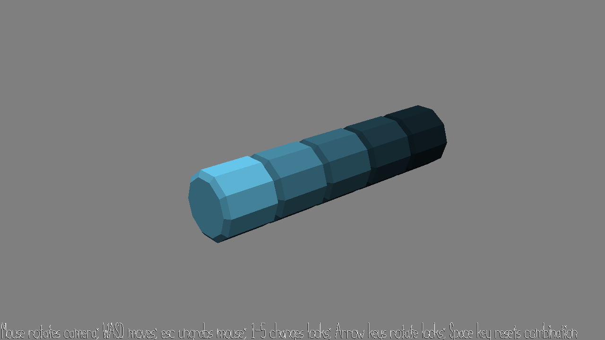

# 15-466 Game 3: Locksmith

Author: Jason Xu

Design: A puzzle game to solve a sequence of 5 locks using the sound of the locks turning.

Screen Shot:

How To Play:

The player's goal is to dial each of the 5 locks to the correct orientation. However, the only indication of whether a code is correct is an audible click when a lock got to the correct code, spatially localized to the center of that lock. The player should solve the puzzle by listening for clicks (headphones recommended) and deducing the correct code. For grading purposes, the correct lock code is displayed in cout upon each random lock code generation, and the current lock code is displayed in cout every time any lock is turned.

The WASD keys and mouse can be used to adjust camera view, which enables the user to listen to the lock sounds more carefully. Using the left and right arrows turns the currently selected lock, and number keys 1-5 switch the selected lock. Note that rotating any lock will also rotate the locks behind it.

Sources: All visual assets created in Blender and audio assets created in JFXR.

This game was built with [NEST](NEST.md).

